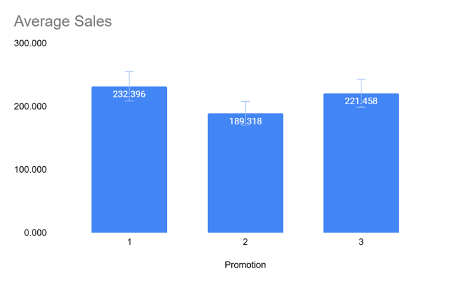
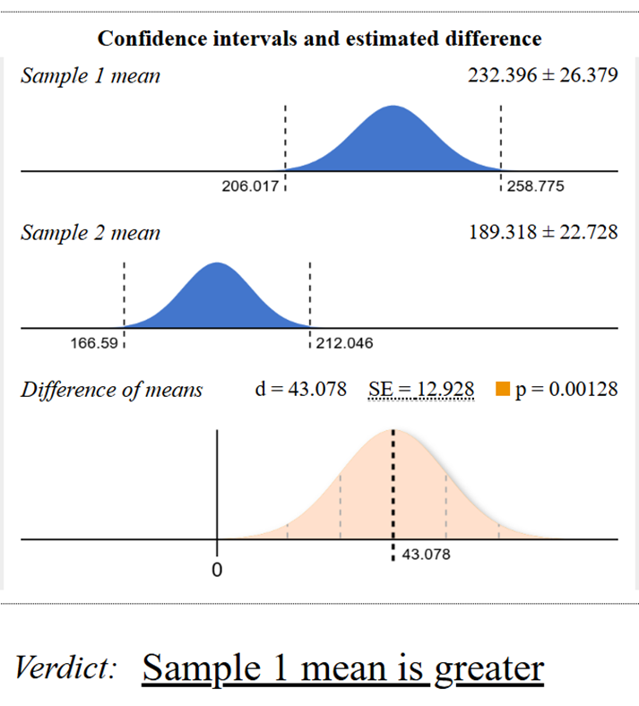
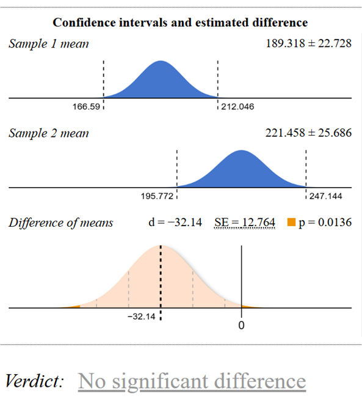
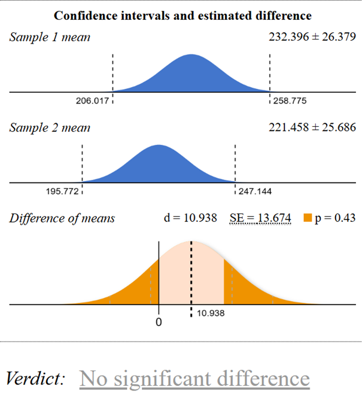

# Fast Food Marketing Campaign A/B Test

This repository contains an analysis of the Fast Food Marketing Campaign A/B Test dataset from [Kaggle](https://www.kaggle.com/datasets/chebotinaa/fast-food-marketing-campaign-ab-test).

## 📊 Project Overview

### Goal
The primary objective was to analyze A/B testing results and determine which promotion had the most significant impact on sales among three different promotional strategies. A fast-food chain planned to add a new item to its menu and tested three promotional approaches across randomly selected markets over four weeks.

### Dataset Description
- **Source**: [Kaggle - Fast Food Marketing Campaign A/B Test](https://www.kaggle.com/datasets/chebotinaa/fast-food-marketing-campaign-ab-test)
- **Study Period**: 4 weeks
- **Test Groups**: 3 independent promotional strategies
- **Markets**: Multiple randomly selected locations

## 📈 Data Structure

The dataset includes the following variables:

| Variable | Type | Description |
|----------|------|-------------|
| `MarketID` | Categorical | Unique identifier for market |
| `MarketSize` | Categorical | Size of market area by sales |
| `LocationID` | Categorical | Unique identifier for store location |
| `AgeOfStore` | Numerical | Age of store in years |
| `Promotion` | Categorical | Promotion type (1, 2, or 3) |
| `week` | Numerical | Week number (1-4) during promotion period |
| `SalesInThousands` | Numerical | Sales amount in thousands USD |

### Key Analysis Variables
- **LocationID**: Unique identifier for each market location (categorical nominal)
- **Promotion**: Type of promotion implemented (categorical with 3 levels)
- **SalesInThousands**: Sales amount in thousands USD (continuous dependent variable)

## 🔬 Methodology

### Experimental Design
- Each location implemented only one type of promotion
- Three independent groups created for comparison
- Sales data aggregated over 4 weeks per location
- Total sales calculated per location under assigned promotion

### Hypotheses

**Overall Hypotheses:**
- **H₀ (Null)**: No difference in average sales between the three promotion types
- **H₁ (Alternative)**: At least one promotion type produces different average sales

**Pairwise Comparisons:**

1. **Promotion 1 vs. Promotion 2**
   - H₀: μ₁ = μ₂
   - H₁: μ₁ ≠ μ₂

2. **Promotion 2 vs. Promotion 3**
   - H₀: μ₂ = μ₃
   - H₁: μ₂ ≠ μ₃

3. **Promotion 1 vs. Promotion 3**
   - H₀: μ₁ = μ₃
   - H₁: μ₁ ≠ μ₃

*Where μ₁, μ₂, and μ₃ represent population means of sales for Promotions 1, 2, and 3 respectively.*

### Statistical Analysis
- **Tool**: [Evan Miller A/B Test Calculator](https://www.evanmiller.org/ab-testing/)
- **Confidence Level**: 99%
- **Method**: Three separate two-group comparisons

## 📊 Results

### Summary Statistics

| Promotion | Average Sales (USD) | Standard Deviation | Sample Size (Locations) |
|-----------|--------------------|--------------------|------------------------|
| 1 | $232,396 | $64,113 | 43 |
| 2 | $189,318 | $57,988 | 47 |
| 3 | $221,458 | $65,535 | 47 |

### Key Findings

**Significant Result:**
- **Promotion 1 vs. Promotion 2**: Statistically significant difference
  - Promotion 1: M = $232,400, SE = $9,780
  - Promotion 2: M = $189,320, SE = $8,460
  - Difference: $43,080 (99% CI [$9,800, $76,350])
  - t(85) = 3.33, p = 0.001

**Non-Significant Results:**
- **Promotion 2 vs. Promotion 3**: No statistically significant difference
- **Promotion 1 vs. Promotion 3**: No statistically significant difference

## 💡 Recommendations

### Primary Recommendation
**Implement Promotion 1 over Promotion 2** - This comparison showed statistically significant superior performance.

### Areas for Further Investigation
1. **Promotion 1 vs. Promotion 3**: Investigate factors that might explain the lack of significant difference despite numerical differences
2. **Promotion 2 vs. Promotion 3**: Analyze why these promotions performed similarly
3. **Additional Analysis**: Consider customer demographics, location characteristics, and other performance metrics

### Suggested Next Steps
- Conduct deeper analysis of location-specific factors
- Examine customer demographic influences
- Consider seasonal or market-specific variations
- Evaluate cost-effectiveness of each promotion type

## 📁 Data Access

### SQL Query
The complete aggregated dataset was generated using the following SQL query:

```sql
WITH aggregated_sales AS (
   SELECT
       promotion,
       location_id,
       ROUND(SUM(sales_in_thousands), 3) AS total_revenue
   FROM
       wa_marketing_campaign
   GROUP BY
       promotion, location_id
),
promotion_stats AS (
   SELECT
       promotion,
       COUNT(location_id) AS location_count,
       ROUND(AVG(total_revenue), 3) AS avg_revenue,
       ROUND(STDDEV(total_revenue), 3) AS std_dev_revenue
   FROM
       aggregated_sales
   GROUP BY
       promotion
)
SELECT
   ags.location_id,
   ags.promotion,
   ags.total_revenue,
   ps.location_count AS number,
   CASE WHEN ags.promotion = 1 THEN ps.avg_revenue ELSE NULL END AS avg_pr_1_revenue,
   CASE WHEN ags.promotion = 2 THEN ps.avg_revenue ELSE NULL END AS avg_pr_2_revenue,
   CASE WHEN ags.promotion = 3 THEN ps.avg_revenue ELSE NULL END AS avg_pr_3_revenue,
   CASE WHEN ags.promotion = 1 THEN ps.std_dev_revenue ELSE NULL END AS std_pr_1_revenue,
   CASE WHEN ags.promotion = 2 THEN ps.std_dev_revenue ELSE NULL END AS std_pr_2_revenue,
   CASE WHEN ags.promotion = 3 THEN ps.std_dev_revenue ELSE NULL END AS std_pr_3_revenue
FROM
   aggregated_sales ags
JOIN
   promotion_stats ps ON ags.promotion = ps.promotion
ORDER BY
   ags.promotion,
   ags.location_id;
```

## 📊 Visualizations

The analysis includes several key visualizations:
- Figure 1: Average Sales by Promotion Type

- Figure 2: Statistical comparison between Promotion 1 and Promotion 2

- Figure 3: Statistical comparison between Promotion 2 and Promotion 3

- Figure 4: Statistical comparison between Promotion 1 and Promotion 3


---
